# FreeCAD GUI Modern API


| META              | VALUE                                             |
|-------------------|---------------------------------------------------|
| __generated__     | 2024-11-10 10:29:15.397564                        |
| __author__        | Frank David Martínez Muñoz                        |
| __copyright__     | (c) 2024 Frank David Martínez Muñoz.              |
| __license__       | LGPL 2.1                                          |
| __version__       | 1.0.0-beta1                                       |
| __min_python__    | 3.8                                               |
| __min_freecad__   | 0.21                                              |


# TABLE OF CONTENTS
* [FreeCAD GUI Modern API](#freecad-gui-modern-api)
* [Preliminaries](#preliminaries)
    * [Disclaimer](#disclaimer)
    * [Audience](#audience)
    * [Goals](#goals)
    * [Non Goals](#non-goals)
* [Features](#features)
* [Widgets](#widgets)
    * [Containers / Layouts](#containers-layouts)
        * [Widget: Dialog](#widget-dialog)
        * [Widget: Scroll](#widget-scroll)
        * [Widget: GroupBox](#widget-groupbox)
        * [Widget: Container](#widget-container)
        * [Widget: TabContainer](#widget-tabcontainer)
        * [Function: Tab](#function-tab)
        * [Widget: Splitter](#widget-splitter)
        * [Widget: Col](#widget-col)
        * [Widget: Row](#widget-row)
    * [Output](#output)
        * [Widget: TextLabel](#widget-textlabel)
        * [Widget: Html](#widget-html)
        * [Widget: ImageView](#widget-imageview)
        * [Widget: SvgImageView](#widget-svgimageview)
        * [Widget: Table](#widget-table)
        * [Widget: Canvas](#widget-canvas)
    * [Inputs](#inputs)
        * [Widget: InputBoolean](#widget-inputboolean)
        * [Widget: InputInt](#widget-inputint)
        * [Widget: InputFloat](#widget-inputfloat)
        * [Widget: InputFloatList](#widget-inputfloatlist)
        * [Widget: InputQuantity](#widget-inputquantity)
        * [Widget: InputVector](#widget-inputvector)
        * [Widget: InputText](#widget-inputtext)
        * [Widget: InputOptions](#widget-inputoptions)
        * [Widget: InputSelectOne](#widget-inputselectone)
        * [Widget: InputSelectMany](#widget-inputselectmany)
        * [Widget: button](#widget-button)
    * [Layout tools](#layout-tools)
        * [Function: Stretch](#function-stretch)
        * [Function: Spacing](#function-spacing)


<p style="page-break-after: always; break-after: page;"></p>


# Preliminaries

## Disclaimer

All of the following information is the result of my own research and usage of
the FreeCAD's Python APIs and Qt/PySide along several years. It reflects my very
own view, coding style and limited understanding of FreeCAD internals. All the
content is based on official docs, forum discussions, development of my own
extensions, reading code of existing extensions and FreeCAD sources.

This document does not cover 100% of the Qt/PySide API because it is huge and not
really required for common Macros in FreeCAD.


## Audience

This is a technical document for developers of FreeCAD extensions using Qt/PySide
as they GUI Framework.

General programming experience, some basic FreeCAD know-how and a minimalistic
comprehension of Python are sufficient, as long as you can search the internet
for a basic grasp of classes, functions, decorators, type hints, etc...;)

It is also expected that the readers are FreeCAD users, and have a good
understanding of the basic usage of it.


## Goals

* The API must be developer friendly, consistent, maintainable and compatible
  with FC 0.21+
* The API must be an overlay on top of the existing PySide API, so no conflicts
  with existing code.
* The API must be 100% documented.


## Non Goals

* It is not intended to replace anything in the existing FreeCAD APIs.
* It is not intended to require any refactoring of existing python code.
* It is not intended to require any refactoring of existing C/C++ code.


<p style="page-break-after: always; break-after: page;"></p>


# Features

- [x] Declarative Layout
  - [x] Code layout reflects GUI Structure
- [x] Custom input widgets
  - [X] InputText
  - [X] Numeric inputs: InputInt, InputFloat, InputQuantity
  - [X] List inputs: InputFloatList
  - [X] InputBoolean
  - [X] InputVector
  - [X] InputOptions
  - [X] Selection input: InputSelectOne, InputSelectMany
  - [X] Buttons
- [x] Custom view widgets
  - [x] Html
  - [x] Image
  - [x] Svg
  - [x] Table
  - [x] Canvas
- [x] Documentation in markdown format.


<p style="page-break-after: always; break-after: page;"></p>


# Widgets

## Containers / Layouts

### Widget: Dialog

#### Signature / Dialog

```python
def Dialog(
        title: str=None, 
        *, 
        size: Tuple[int, int]=None, 
        show: bool=True, 
        modal: bool=True, 
        parent: QWidget=None, 
        **kwargs
    ) -> Generator[QDialog, Any, Any]: ...
```


#### Gui / Dialog

<p style="align: center; border: 1px solid black">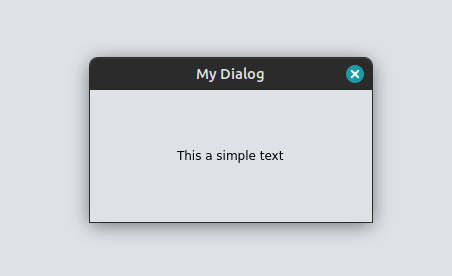</p>

#### Docs / Dialog


| Return type    | Description                                       |
|----------------|---------------------------------------------------|
| QDialog        | The Dialog                                        |

| Argument       | Type           | Description                                |
|----------------|----------------|--------------------------------------------|
| title          | str            | window title, defaults to None             |
| size           | Tuple[int, int]| dialog size, defaults to None              |
| show           | bool           | show automatically, defaults to True       |
| modal          | bool           | window modality, defaults to True          |
| parent         | QWidget        | parent widget, defaults to None            |
| **kwargs       | Dict[str, Any] | Qt properties                              |


Dialog context manager/widget.

Example:
> *../examples/ui/widgets.py* (Dialog)


```python
def demo_Dialog():
    with ui.Dialog("Dialog"):
        with ui.Col():
            ui.TextLabel("This a simple text", alignment=Qt.AlignCenter)

```
    
### Widget: Scroll

#### Signature / Scroll

```python
def Scroll(*, add: bool=True, **kwargs) -> Generator[QScrollArea, Any, Any]: ...
```


#### Gui / Scroll

<p style="align: center; border: 1px solid black">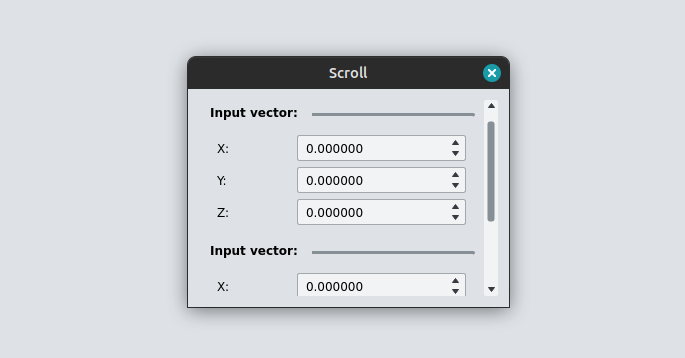</p>

#### Docs / Scroll


| Return type    | Description                                       |
|----------------|---------------------------------------------------|
| QScrollArea    | Scroll widget                                     |

| Argument       | Type           | Description                                |
|----------------|----------------|--------------------------------------------|
| add            | bool           | add to context, defaults to True           |
| **kwargs       | Dict[str, Any] | Qt properties                              |


Scrollable area context manager/widget.

Example:
> *../examples/ui/widgets.py* (Scroll)


```python
def demo_Scroll():
    with ui.Dialog("Scroll"):
        with ui.Scroll(widgetResizable=True):
            with ui.Container():
                _v1 = ui.InputVector(label="Input vector:")
                _v2 = ui.InputVector(label="Input vector:")

```
    
### Widget: GroupBox

#### Signature / GroupBox

```python
def GroupBox(
        title: str=None, 
        *, 
        add: bool=True, 
        **kwargs
    ) -> Generator[QGroupBox, Any, Any]: ...
```


#### Gui / GroupBox

<p style="align: center; border: 1px solid black">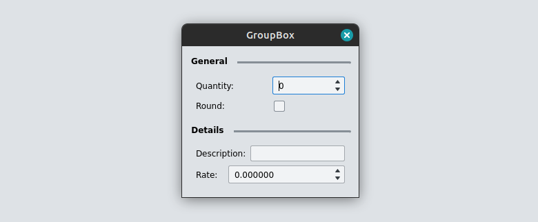</p>

#### Docs / GroupBox


| Return type    | Description                                       |
|----------------|---------------------------------------------------|
| QGroupBox      | The group widget                                  |

| Argument       | Type           | Description                                |
|----------------|----------------|--------------------------------------------|
| title          | str            | Group title, defaults to None              |
| add            | bool           | add to context, defaults to True           |
| add            | bool           | add to context, defaults to True           |
| **kwargs       | Dict[str, Any] | Qt properties                              |


GroupBox context manager/widget.

Example:
> *../examples/ui/widgets.py* (GroupBox)


```python
def demo_GroupBox():
    with ui.Dialog("GroupBox"):
        with ui.GroupBox("General"):
            _quant = ui.InputInt(label="Quantity:")
            _round = ui.InputBoolean(label="Round:")
        with ui.GroupBox("Details"):
            _desc = ui.InputText(label="Description:")
            _rate = ui.InputFloat(label="Rate:")

```
    
### Widget: Container

#### Signature / Container

```python
def Container(*, add: bool=True, **kwargs) -> Generator[QFrame, Any, Any]: ...
```


#### Docs / Container


| Return type    | Description                                       |
|----------------|---------------------------------------------------|
| QFrame         | The container widget                              |

| Argument       | Type           | Description                                |
|----------------|----------------|--------------------------------------------|
| add            | bool           | add to context, defaults to True           |
| **kwargs       | Dict[str, Any] | Qt properties                              |


Simple container context/widget.

Example
> *../examples/ui/widgets.py* (Scroll)


```python
def demo_Scroll():
    with ui.Dialog("Scroll"):
        with ui.Scroll(widgetResizable=True):
            with ui.Container():
                _v1 = ui.InputVector(label="Input vector:")
                _v2 = ui.InputVector(label="Input vector:")

```
    
### Widget: TabContainer

#### Signature / TabContainer

```python
def TabContainer(
        *, 
        stretch: int=0, 
        add: bool=True, 
        **kwargs
    ) -> Generator[QTabWidget, Any, Any]: ...
```


#### Gui / TabContainer

<p style="align: center; border: 1px solid black">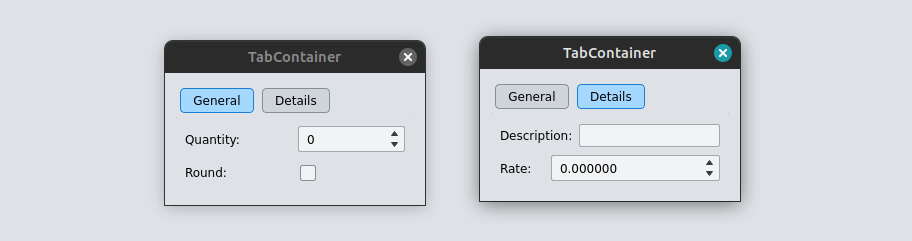</p>

#### Docs / TabContainer


| Return type    | Description                                       |
|----------------|---------------------------------------------------|
| QTabWidget     | The widget                                        |

| Argument       | Type           | Description                                |
|----------------|----------------|--------------------------------------------|
| stretch        | int            | stretch, defaults to 0                     |
| add            | bool           | add to the context, defaults to True       |
| **kwargs       | Dict[str, Any] | Qt properties                              |


Tab Container context/widget

Example:
> *../examples/ui/widgets.py* (TabContainer)


```python
def demo_TabContainer():
    with ui.Dialog("TabContainer"):
        with ui.TabContainer():
            with ui.Tab("General"):
                _quant = ui.InputInt(label="Quantity:")
                _round = ui.InputBoolean(label="Round:")
            with ui.Tab("Details"):
                _desc = ui.InputText(label="Description:")
                _rate = ui.InputFloat(label="Rate:")

```
    
### Function: Tab

#### Signature / Tab

```python
def Tab(
        title: str, 
        *, 
        icon: QIcon=None, 
        add: bool=True, 
        **kwargs
    ) -> Generator[QWidget, Any, Any]: ...
```


#### Docs / Tab


| Return type    | Description                                       |
|----------------|---------------------------------------------------|
| QWidget        | the widget                                        |

| Argument       | Type           | Description                                |
|----------------|----------------|--------------------------------------------|
| title          | str            | Tab's title                                |
| icon           | QIcon          | Icon, defaults to None                     |
| add            | bool           | add to the context, defaults to True       |
| **kwargs       | Dict[str, Any] | Qt properties                              |


Tab widget/context in a tab container

Example:
> *../examples/ui/widgets.py* (TabContainer)


```python
def demo_TabContainer():
    with ui.Dialog("TabContainer"):
        with ui.TabContainer():
            with ui.Tab("General"):
                _quant = ui.InputInt(label="Quantity:")
                _round = ui.InputBoolean(label="Round:")
            with ui.Tab("Details"):
                _desc = ui.InputText(label="Description:")
                _rate = ui.InputFloat(label="Rate:")

```
### Widget: Splitter

#### Signature / Splitter

```python
def Splitter(*, add=True, **kwargs) -> Generator[QSplitter, Any, Any]: ...
```


#### Gui / Splitter

<p style="align: center; border: 1px solid black">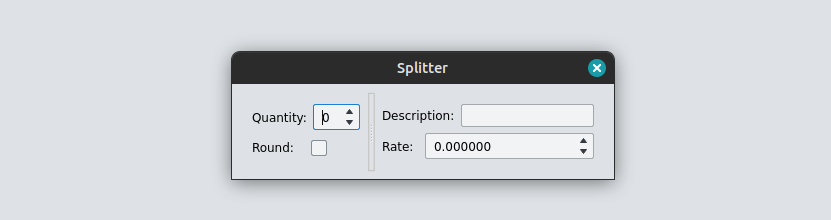</p>

#### Docs / Splitter


| Return type    | Description                                       |
|----------------|---------------------------------------------------|
| QSplitter      | The splitter widget                               |

| Argument       | Type           | Description                                |
|----------------|----------------|--------------------------------------------|
| add            | bool           | add to current context, defaults to True   |
| **kwargs       | Dict[str, Any] | Qt properties                              |


Split context/container

Example:
> *../examples/ui/widgets.py* (Splitter)


```python
def demo_Splitter():
    with ui.Dialog("Splitter"):
        with ui.Splitter():
            with ui.Container():
                _quant = ui.InputInt(label="Quantity:")
                _round = ui.InputBoolean(label="Round:")
            with ui.Container():
                _desc = ui.InputText(label="Description:")
                _rate = ui.InputFloat(label="Rate:")

```
    
### Widget: Col

#### Signature / Col

```python
def Col(*, add: bool=True, **kwargs) -> Generator[QWidget, Any, Any]: ...
```


#### Gui / Col

<p style="align: center; border: 1px solid black">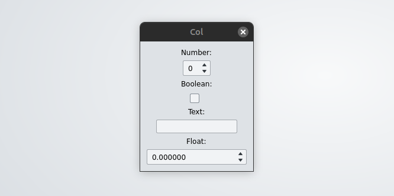</p>

#### Docs / Col


| Return type    | Description                                       |
|----------------|---------------------------------------------------|
| QWidget        | A container widget with Vertical layout           |

| Argument       | Type           | Description                                |
|----------------|----------------|--------------------------------------------|
| add            | bool           | add to current context, defaults to True   |
| **kwargs       | Dict[str, Any] | Qt properties                              |


Vertical context/layout

Example:
> *../examples/ui/widgets.py* (Col)


```python
def demo_Col():
    with ui.Dialog("Col"):
        with ui.Col():
            ui.TextLabel("Number:", alignment=Qt.AlignCenter)
            ui.InputInt(alignment=Qt.AlignCenter)
            ui.TextLabel("Boolean:", alignment=Qt.AlignCenter)
            ui.InputBoolean(alignment=Qt.AlignCenter)
            ui.TextLabel("Text:", alignment=Qt.AlignCenter)
            ui.InputText(alignment=Qt.AlignCenter)
            ui.TextLabel("Float:", alignment=Qt.AlignCenter)
            ui.InputFloat(alignment=Qt.AlignCenter)

```
    
### Widget: Row

#### Signature / Row

```python
def Row(*, add: bool=True, **kwargs): ...
```


#### Gui / Row

<p style="align: center; border: 1px solid black">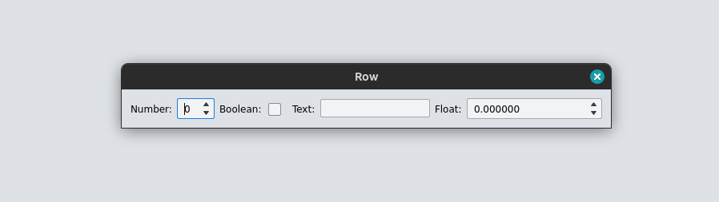</p>

#### Docs / Row


| Return type    | Description                                       |
|----------------|---------------------------------------------------|
| QWidget        | A container widget with Horizontal layout         |

| Argument       | Type           | Description                                |
|----------------|----------------|--------------------------------------------|
| add            | bool           | add to current context, defaults to True   |
| **kwargs       | Dict[str, Any] | Qt properties                              |


Horizontal context/layout

Example:
> *../examples/ui/widgets.py* (Row)


```python
def demo_Row():
    with ui.Dialog("Row"):
        with ui.Row():
            ui.TextLabel("Number:")
            ui.InputInt()
            ui.TextLabel("Boolean:")
            ui.InputBoolean()
            ui.TextLabel("Text:")
            ui.InputText()
            ui.TextLabel("Float:")
            ui.InputFloat()

```
    

## Output

### Widget: TextLabel

#### Signature / TextLabel

```python
def TextLabel(
        text: str='', 
        *, 
        stretch: int=0, 
        alignment: Qt.Alignment=Qt.Alignment(), 
        add: bool=True, 
        **kwargs
    ) -> QLabel: ...
```


#### Gui / TextLabel

<p style="align: center; border: 1px solid black">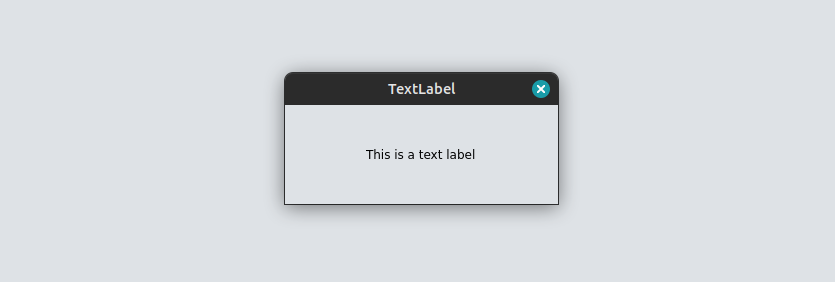</p>

#### Docs / TextLabel


| Return type    | Description                                       |
|----------------|---------------------------------------------------|
| QLabel         | The widget                                        |

| Argument       | Type           | Description                                |
|----------------|----------------|--------------------------------------------|
| text           | str            | text, defaults to ""                       |
| stretch        | int            | layout stretch, defaults to 0              |
| alignment      | Qt.Alignment   | layout alignment, defaults to Qt.Alignment()|
| add            | bool           | add to current context, defaults to True   |
| **kwargs       | Dict[str, Any] | Qt properties of QLabel                    |


Simple text label widget

Example:
> *../examples/ui/widgets.py* (TextLabel)


```python
def demo_TextLabel():
    with ui.Dialog("TextLabel"):
        with ui.Col():
            ui.TextLabel("This is a text label", alignment=Qt.AlignCenter)

```
    
### Widget: Html

#### Signature / Html

```python
def Html(
        *, 
        html: str=None, 
        file: str=None, 
        css: str=None, 
        css_file: str=None, 
        base_path: str=None, 
        background: str=None, 
        stretch: int=0, 
        alignment: Qt.Alignment=Qt.Alignment(), 
        variables: Dict[str, Any]=None, 
        add: bool=True, 
        **kwargs
    ) -> HtmlWidget: ...
```


#### Gui / Html

<p style="align: center; border: 1px solid black"></p>

#### Docs / Html


| Return type    | Description                                       |
|----------------|---------------------------------------------------|
| HtmlWidget     | Html Widget                                       |

| Argument       | Type           | Description                                |
|----------------|----------------|--------------------------------------------|
| html           | str            | raw html content, defaults to None         |
| file           | str            | path to html file, defaults to None        |
| css            | str            | raw css code, defaults to None             |
| css_file       | str            | path to css file, defaults to None         |
| base_path      | str            | base dir for loading resources, defaults to None|
| background     | str            | background color code, defaults to None    |
| stretch        | int            | layout stretch, defaults to 0              |
| alignment      | Qt.Alignment   | layout alignment, defaults to Qt.Alignment()|
| variables      | Dict[str, Any] | interpolation variables, defaults to None  |
| add            | bool           | add to current context, defaults to True   |
| **kwargs       | Dict[str, Any] | Qt properties of QLabel                    |


Basic HTML Render widget

Example:
> *../examples/ui/widgets.py* (Html)


```python
def demo_Html():
    with ui.Dialog("Html"):
        with ui.Col():
            ui.Html(
                background="#ffffff",
                html="""
                <h1>Header</h1>
                <ul>
                    <li>Item 1</li>
                    <li>Item 1</li>
                    <li>Item 1</li>
                </ul>
                <br />
                <p>
                <strong>Be Happy!!</strong>
                </p>
                """
            )

```
    
### Widget: ImageView

#### Signature / ImageView

```python
def ImageView(
        uri: str, 
        *, 
        label: str=None, 
        name: str=None, 
        background: Union[str, QColor]=None, 
        add: bool=True, 
        **kwargs
    ) -> ImageViewWidget: ...
```


#### Gui / ImageView

<p style="align: center; border: 1px solid black">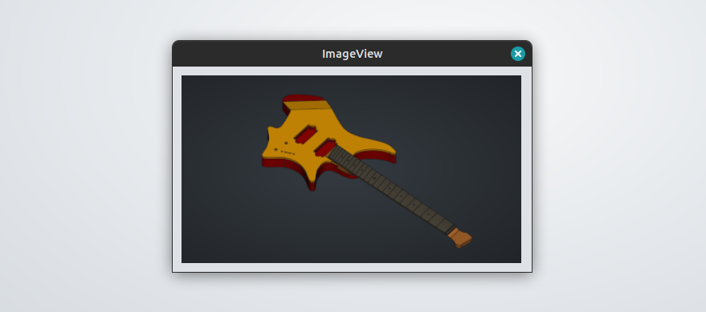</p>

#### Docs / ImageView


| Return type    | Description                                       |
|----------------|---------------------------------------------------|
| ImageViewWidget| _description_                                     |

| Argument       | Type           | Description                                |
|----------------|----------------|--------------------------------------------|
| uri            | str            | path to load the image from                |
| label          | str            | gui label, defaults to None                |
| name           | str            | objectName, defaults to None               |
| background     | Union[str, QColor]| background color, defaults to None         |
| add            | bool           | _description_, defaults to True            |


Image render widget

Example:
> *../examples/ui/widgets.py* (ImageView)


```python
def demo_ImageView():
    with ui.Dialog("ImageView", size=(400, 300)):
        with ui.Col():
            ui.ImageView(
                str(Path(__file__).parent / 'image.png')
            )

```
    
### Widget: SvgImageView

#### Signature / SvgImageView

```python
def SvgImageView(
        uri: str, 
        name: str=None, 
        label: str=None, stretch=0, alignment=Qt.Alignment(), 
        **kwargs
    ) -> SvgImageViewWidget: ...
```


#### Gui / SvgImageView

<p style="align: center; border: 1px solid black">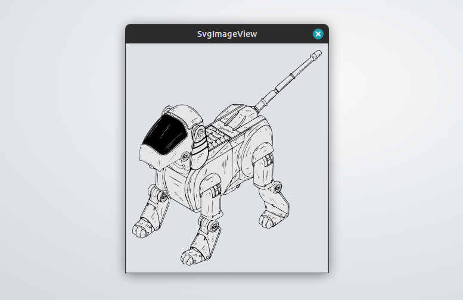</p>

#### Docs / SvgImageView


| Return type    | Description                                       |
|----------------|---------------------------------------------------|
| SvgImageViewWidget| The widget                                        |

| Argument       | Type           | Description                                |
|----------------|----------------|--------------------------------------------|
| uri            | str            | file path if the svg                       |
| name           | str            | Widget name, defaults to None              |


High resolution Svg Image box

Example:
> *../examples/ui/widgets.py* (SvgImageView)


```python
def demo_SvgImageView():
    with ui.Dialog("SvgImageView"):
        with ui.Col():
            ui.SvgImageView(
                str(Path(__file__).parent / 'vector.svg')
            )

```
    
### Widget: Table

#### Signature / Table

```python
def Table(
        headers: List[str], 
        rows: List[List[Any]], 
        *, 
        name: str=None, 
        stretch: int=0, 
        alignment: Qt.Alignment=Qt.Alignment(), 
        add: bool=True, 
        **kwargs
    ) -> TableWidget: ...
```


#### Gui / Table

<p style="align: center; border: 1px solid black"></p>

#### Docs / Table


| Return type    | Description                                       |
|----------------|---------------------------------------------------|
| TableWidget    | The table widget                                  |

| Argument       | Type           | Description                                |
|----------------|----------------|--------------------------------------------|
| headers        | List[str]      | column headers                             |
| rows           | List[List[Any]]| data                                       |
| name           | str            | objectName, defaults to None               |
| stretch        | int            | layout stretch, defaults to 0              |
| alignment      | Qt.Alignment   | layout alignment, defaults to Qt.Alignment()|
| add            | bool           | add to current context, defaults to True   |


Simple Table output widget

Example:
> *../examples/ui/widgets.py* (Table)


```python
def demo_Table():
    with ui.Dialog("Table"):
        with ui.Col():
            ui.Table(
                headers=('Length', '^Width', '>Height'),
                rows=[
                    [21, 34, 56],
                    [65, 87, 98],
                    [21, 32, 54],
                    [65, 76, 87],
                ]
            )

```
    
### Widget: Canvas

#### Signature / Canvas

```python
def Canvas(
        paint: Callable[[QWidget, QPainter, QPaintEvent], None], 
        *, 
        setup: Callable[[QWidget, QPainter, QPaintEvent], None]=None, 
        name: str=None, 
        stretch: int=0, 
        width: int=0, 
        height: int=0, 
        **kwargs
    ) -> CanvasWidget: ...
```


#### Gui / Canvas

<p style="align: center; border: 1px solid black">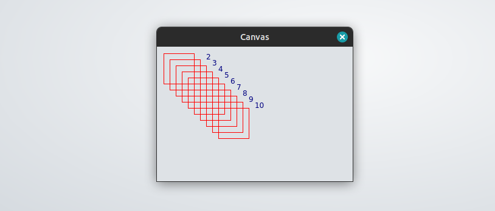</p>

#### Docs / Canvas


| Return type    | Description                                       |
|----------------|---------------------------------------------------|
| CanvasWidget   | The widget                                        |

| Argument       | Type           | Description                                |
|----------------|----------------|--------------------------------------------|
| paint          | Callable[[QWidget, QPainter, QPaintEvent], None]| function to paint                          |
| setup          | Callable[[QWidget, QPainter, QPaintEvent], None]| function to setup canvas, defaults to None |
| name           | str            | objectName, defaults to None               |
| stretch        | int            | layout stretch, defaults to 0              |
| width          | int            | minimum width, defaults to 0               |
| height         | int            | minimum height, defaults to 0              |


Canvas Widget to allow custom painting

Example:
> *../examples/ui/widgets.py* (Canvas)


```python
def demo_Canvas():

    def render(widget: QWidget, qp: QPainter, ch: ui.CanvasHelper):
        for i in range(10):
            with ch.pen(color=Qt.red, width=1):
                qp.drawRect(QRect(i*10, i*10, 50, 50))
            with ch.pen(color=Qt.darkBlue, width=2):
                qp.drawText(i*10+60, i*10, str(i+1))

    with ui.Dialog("Canvas"):
        ui.Canvas(render, width=300, height=200)


```
    

## Inputs

### Widget: InputBoolean

#### Signature / InputBoolean

```python
def InputBoolean(
        value: bool=False, 
        *, 
        name: str=None, 
        label: Union[QWidget, str]=None, 
        stretch: int=0, 
        alignment: Qt.Alignment=Qt.Alignment(), 
        add: bool=True, 
        **kwargs
    ) -> QCheckBoxExt: ...
```


#### Gui / InputBoolean

<p style="align: center; border: 1px solid black">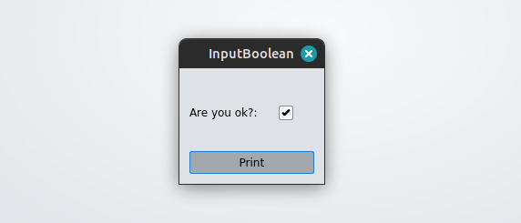</p>

#### Docs / InputBoolean


| Return type    | Description                                       |
|----------------|---------------------------------------------------|
| QCheckBoxExt   | The widget                                        |

| Argument       | Type           | Description                                |
|----------------|----------------|--------------------------------------------|
| value          | bool           | initial value, defaults to False           |
| name           | str            | objectName, defaults to None               |
| label          | Union[QWidget, str]| ui label, defaults to None                 |
| stretch        | int            | layout stretch, defaults to 0              |
| alignment      | Qt.Alignment   | layout alignment, defaults to Qt.Alignment()|
| add            | bool           | add to the gui, defaults to True           |
| **kwargs       | Dict[str, Any] | settable QCheckBox properties              |


Input boolean widget as QCheckBox

Example:
> *../examples/ui/widgets.py* (InputBoolean)


```python
def demo_InputBoolean():
    with ui.Dialog("InputBoolean"):
        val = ui.InputBoolean(label="Are you ok?:", alignment=Qt.AlignCenter)

        @ui.button("Print")
        def btn_print():
            ui.print_log(val.value())

```
    
### Widget: InputInt

#### Signature / InputInt

```python
def InputInt(
        value: int=0, 
        *, 
        name: str=None, 
        min: int=0, 
        max: int=None, 
        step: int=1, 
        label: Union[QWidget, str]=None, 
        stretch: int=0, 
        alignment: Qt.Alignment=Qt.Alignment(), 
        add: bool=True, 
        **kwargs
    ) -> QSpinBox: ...
```


#### Gui / InputInt

<p style="align: center; border: 1px solid black">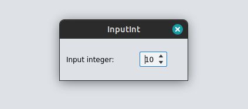</p>

#### Docs / InputInt


| Return type    | Description                                       |
|----------------|---------------------------------------------------|
| QSpinBox       | The input widget                                  |

| Argument       | Type           | Description                                |
|----------------|----------------|--------------------------------------------|
| value          | int            | initial value, defaults to 0               |
| name           | str            | objectName, defaults to None               |
| min            | int            | minimum accepted value, defaults to 0      |
| max            | int            | maximum accepted value, defaults to None   |
| step           | int            | spin steps, defaults to 1                  |
| label          | Union[QWidget, str]| ui label, defaults to None                 |
| stretch        | int            | layout stretch, defaults to 0              |
| alignment      | Qt.Alignment   | layout alignment, defaults to Qt.Alignment()|
| add            | bool           | add to current context, defaults to True   |
| **kwargs       | Dict[str, Any] | Qt properties                              |


Input int widget

Example:
> *../examples/ui/widgets.py* (InputInt)


```python
def demo_InputInt():
    with ui.Dialog("InputInt"):
        val = ui.InputInt(value=5, label="Enter is an int:", alignment=Qt.AlignCenter)

        @ui.button("Print")
        def print_int():
            ui.print_log(val.value())

```
    
### Widget: InputFloat

#### Signature / InputFloat

```python
def InputFloat(
        value: float=0.0, 
        *, 
        name: str=None, 
        min: float=0.0, 
        max: float=sys.float_info.max, 
        decimals: int=6, 
        step: float=0.01, 
        label: Union[QWidget, str]=None, 
        stretch: int=0, 
        alignment: Qt.Alignment=Qt.Alignment(), 
        add: bool=True, 
        **kwargs
    ) -> QDoubleSpinBox: ...
```


#### Gui / InputFloat

<p style="align: center; border: 1px solid black">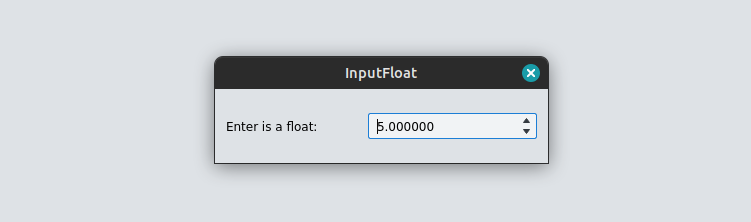</p>

#### Docs / InputFloat


| Return type    | Description                                       |
|----------------|---------------------------------------------------|
| QDoubleSpinBox | The input widget                                  |

| Argument       | Type           | Description                                |
|----------------|----------------|--------------------------------------------|
| value          | float          | initial value, defaults to 0.0             |
| name           | str            | objectName, defaults to None               |
| min            | float          | minimum accepted value, defaults to 0.0    |
| max            | float          | maximum accepted value, defaults to sys.float_info.max|
| decimals       | int            | decimal digits, defaults to 6              |
| step           | float          | spin steps, defaults to 0.01               |
| label          | Union[QWidget, str]| ui label, defaults to None                 |
| stretch        | int            | layout stretch, defaults to 0              |
| alignment      | Qt.Alignment   | layout alignment, defaults to Qt.Alignment()|
| add            | bool           | add to current context, defaults to True   |
| **kwargs       | Dict[str, Any] | Qt properties                              |


Input float widget

Example:
> *../examples/ui/widgets.py* (InputFloat)


```python
def demo_InputFloat():
    with ui.Dialog("InputFloat"):
        val = ui.InputFloat(value=5.0, label="Enter is a float:", alignment=Qt.AlignCenter)

        @ui.button("Print")
        def print_float():
            ui.print_log(val.value())

```
    
### Widget: InputFloatList

#### Signature / InputFloatList

```python
def InputFloatList(
        values: List[float]=None, 
        label: Union[QWidget, str]=None, 
        name: str=None, 
        label_fn: Callable[[int], str]=None, 
        count: int=0, 
        resizable: bool=False, 
        min_count: int=0, 
        add: bool=True, 
        **kwargs
    ): ...
```


#### Gui / InputFloatList

<p style="align: center; border: 1px solid black">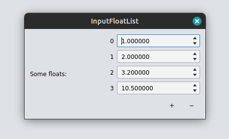</p>

#### Docs / InputFloatList


| Return type    | Description                                       |
|----------------|---------------------------------------------------|
| InputFloatListWidget| The widget                                        |

| Argument       | Type           | Description                                |
|----------------|----------------|--------------------------------------------|
| values         | List[float]    | initial values, defaults to None           |
| label          | Union[QWidget, str]| ui label, defaults to None                 |
| name           | str            | objectName, defaults to None               |
| label_fn       | Callable[[int], str]| label provider (for custom row labels), defaults to None|
| count          | int            | number of autogenerated rows, defaults to 0|
| resizable      | bool           | allow resizing the list, defaults to False |
| min_count      | int            | minimum number of rows, defaults to 0      |
| add            | bool           | add to the gui, defaults to True           |
| **kwargs       | Dict[str, Any] | Qt properties                              |


Widget to accept lists of float numbers.

Example:
> *../examples/ui/widgets.py* (InputFloatList)


```python
def demo_InputFloatList():
    with ui.Dialog("InputFloatList"):
        with ui.Col():
            val = ui.InputFloatList(
                values=[1.0, 2.0, 3.2, 10.5],
                label="Some floats:",
                resizable=True,
            )

            @ui.button("Print")
            def btn_print():
                ui.print_log(val.value())

```
    
### Widget: InputQuantity

#### Signature / InputQuantity

```python
def InputQuantity(
        value: Numeric=None, 
        *, 
        name: str=None, 
        min: Numeric=None, 
        max: Numeric=None, 
        step: Numeric=1.0, 
        label: Union[QWidget, str]=None, 
        stretch: int=0, 
        alignment: Qt.Alignment=Qt.Alignment(), 
        unit: str=None, 
        obj: object=None, 
        property: str=None, 
        add: bool=True, 
        **kwargs
    ) -> InputQuantityWidget: ...
```


#### Gui / InputQuantity

<p style="align: center; border: 1px solid black">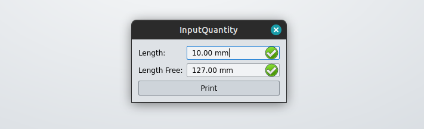</p>

#### Docs / InputQuantity


| Return type    | Description                                       |
|----------------|---------------------------------------------------|
| InputQuantityWidget| The widget                                        |

| Argument       | Type           | Description                                |
|----------------|----------------|--------------------------------------------|
| value          | Numeric        | Initial value, defaults to None            |
| name           | str            | objectName (Qt), defaults to None          |
| min            | Numeric        | Minimum accepted value, defaults to None   |
| max            | Numeric        | Maximum accepted value, defaults to None   |
| step           | Numeric        | Spin step, defaults to 1.0                 |
| label          | Union[QWidget, str]| gui label, defaults to None                |
| stretch        | int            | Layout stretch, defaults to 0              |
| alignment      | Qt.Alignment   | Layout alignment, defaults to Qt.Alignment()|
| unit           | str            | quantity unit (i.e. mm, in, ...), defaults to None|
| obj            | DocumentObject | Object to bind the expression engine, defaults to None|
| property       | str            | Property name of the bounded DocumentObject if any, defaults to None|
| add            | bool           | Add to current context, defaults to True   |
| **kwargs       | Dict[str, Any] | Qt properties                              |


Input Quantity Widget with unit and expressions support.

Example:
> *../examples/ui/widgets.py* (InputQuantity)


```python
def demo_InputQuantity():
    App.activeDocument().addObject("Part::Box", "Box1")
    with ui.Dialog("InputQuantity"):
        quantity = ui.InputQuantity(
            label="Length:",
            obj=App.activeDocument().getObject("Box1"),
            property="Length",
            unit="in",
            alignment=Qt.AlignCenter,
        )

        quantity2 = ui.InputQuantity(
            value=5.0, label="Length Free:", unit="in", alignment=Qt.AlignCenter
        )

        @ui.button("Print")
        def print_q():
            ui.print_log(quantity.value(), quantity2.value())

```
    
### Widget: InputVector

#### Signature / InputVector

```python
def InputVector(
        label: Union[QWidget, str]=None, 
        value: Union[Tuple, Vector]=(0.0, 0.0, 0.0)
    ) -> InputVectorWrapper: ...
```


#### Gui / InputVector

<p style="align: center; border: 1px solid black">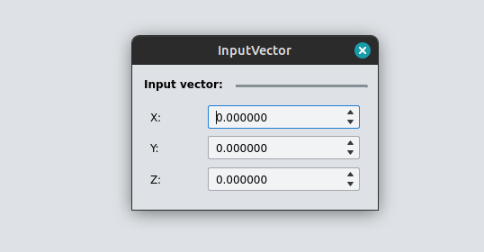</p>

#### Docs / InputVector


| Return type    | Description                                       |
|----------------|---------------------------------------------------|
| InputVectorWrapper| The widget                                        |

| Argument       | Type           | Description                                |
|----------------|----------------|--------------------------------------------|
| label          | Union[QWidget, str]| ui label, defaults to None                 |
| value          | Union[Tuple, Vector]| vector value, defaults to (0.0, 0.0, 0.0)  |


Widget to accept a vector.

Example:
> *../examples/ui/widgets.py* (InputVector)


```python
def demo_InputVector():
    with ui.Dialog("InputVector"):
        with ui.Col():
            val = ui.InputVector(label="Input vector:")

            @ui.button("Print")
            def btn_print():
                ui.print_log(val.value())

```
    
### Widget: InputText

#### Signature / InputText

```python
def InputText(
        value: str='', 
        *, 
        name: str=None, 
        label: Union[QWidget, str]=None, 
        stretch: int=0, 
        alignment: Qt.Alignment=Qt.Alignment(), 
        add: bool=True, 
        **kwargs
    ) -> InputTextWidget: ...
```


#### Gui / InputText

<p style="align: center; border: 1px solid black">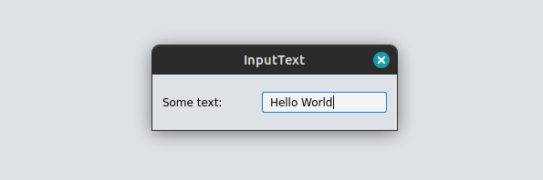</p>

#### Docs / InputText


| Return type    | Description                                       |
|----------------|---------------------------------------------------|
| InputTextWidget| The widget                                        |

| Argument       | Type           | Description                                |
|----------------|----------------|--------------------------------------------|
| value          | str            | initial value, defaults to ""              |
| name           | str            | objectName, defaults to None               |
| label          | Union[QWidget, str]| gui label, defaults to None                |
| stretch        | int            | layout stretch, defaults to 0              |
| alignment      | Qt.Alignment   | layout alignment, defaults to Qt.Alignment()|
| add            | bool           | add to current context, defaults to True   |
| **kwargs       | Dict[str, Any] | Qt properties                              |


Input text widget

Example:
> *../examples/ui/widgets.py* (InputText)


```python
def demo_InputText():
    with ui.Dialog("InputText"):
        text = ui.InputText(value="Hello World", label="Some text:", alignment=Qt.AlignCenter)

        @ui.button("Print")
        def print_text():
            ui.print_log(text.value())

```
    
### Widget: InputOptions

#### Signature / InputOptions

```python
def InputOptions(
        options: Dict[str, Hashable], 
        value: Hashable=None, 
        label: str=None, 
        name: str=None, 
        stretch: int=0, 
        alignment: Qt.Alignment=Qt.Alignment(), 
        **kwargs
    ) -> InputOptionsWidget: ...
```


#### Gui / InputOptions

<p style="align: center; border: 1px solid black">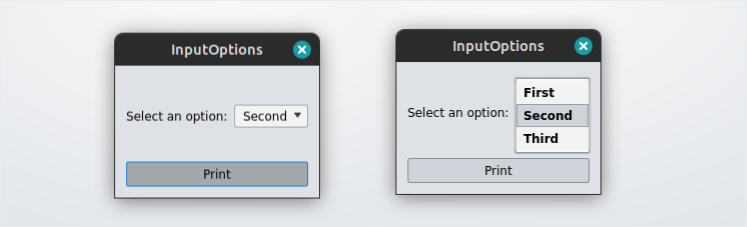</p>

#### Docs / InputOptions


| Return type    | Description                                       |
|----------------|---------------------------------------------------|
| InputOptionsWidget| The widget                                        |

| Argument       | Type           | Description                                |
|----------------|----------------|--------------------------------------------|
| options        | Dict[str, Hashable]| label to value mapping                     |
| value          | Hashable       | initial value, defaults to None            |
| label          | str            | gui label, defaults to None                |
| name           | str            | objectName, defaults to None               |
| stretch        | int            | layout stretch, defaults to 0              |
| alignment      | Qt.Alignment   | layout alignment, defaults to Qt.Alignment()|
| **kwargs       | Dict[str, Any] | Qt properties                              |


ComboBox widget

Example:
> *../examples/ui/widgets.py* (InputOptions)


```python
def demo_InputOptions():
    with ui.Dialog("InputOptions"):
        val = ui.InputOptions(
            options={
                "First": 10,
                "Second": 20,
                "Third": 30,
            },
            value=20,
            label="Select an option:",
            alignment=Qt.AlignCenter,
        )

        @ui.button("Print")
        def print_opt():
            ui.print_log(val.value())

```
    
### Widget: InputSelectOne

#### Signature / InputSelectOne

```python
def InputSelectOne(
        label: str=None, 
        name: str=None, 
        active: bool=False, 
        auto_deactivate: bool=True
    ): ...
```


#### Gui / InputSelectOne

<p style="align: center; border: 1px solid black">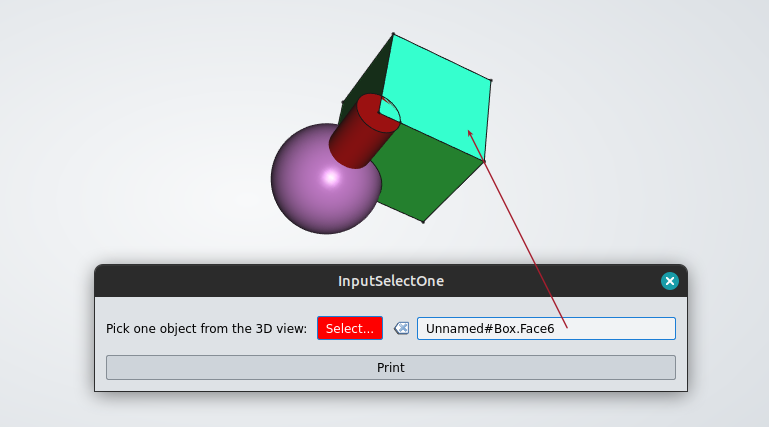</p>

#### Docs / InputSelectOne


| Argument       | Type           | Description                                |
|----------------|----------------|--------------------------------------------|
| label          | str            | gui label, defaults to None                |
| name           | str            | objectName, defaults to None               |
| active         | bool           | activated by default, defaults to False    |
| auto_deactivate| bool           | _description_, defaults to True            |


3D Selection widget. Allows to pick an object

Example:
> *../examples/ui/widgets.py* (InputSelectOne)


```python
def demo_InputSelectOne():
    with ui.Dialog("InputSelectOne", modal=False):
        val = ui.InputSelectOne(label="Pick one object from the 3D view:")

        @ui.button("Print")
        def print_sel():
            ui.print_log(val.value())

```
    
### Widget: InputSelectMany

#### Signature / InputSelectMany

```python
def InputSelectMany(label: str=None, name: str=None, active: bool=False): ...
```


#### Gui / InputSelectMany

<p style="align: center; border: 1px solid black">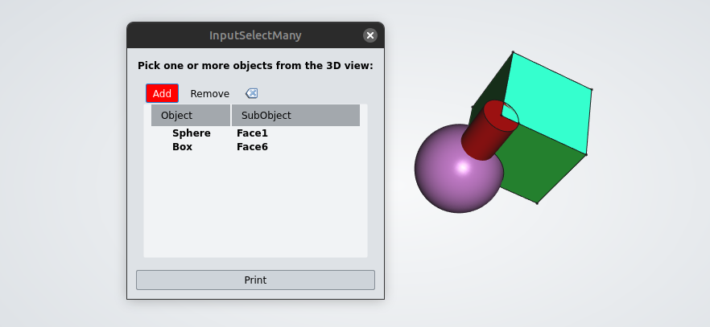</p>

#### Docs / InputSelectMany


| Argument       | Type           | Description                                |
|----------------|----------------|--------------------------------------------|
| label          | str            | gui label, defaults to None                |
| name           | str            | objectName, defaults to None               |
| active         | bool           | active by default or not, defaults to False|


3D Multi-Selection Widget.

Example:
> *../examples/ui/widgets.py* (InputSelectMany)


```python
def demo_InputSelectMany():
    with ui.Dialog("InputSelectMany", modal=False):
        val = ui.InputSelectMany(label="Pick one or more objects from the 3D view:")

        @ui.button("Print")
        def print_sel():
            ui.print_log(val.value())

```
    
### Widget: button

#### Signature / button

```python
def button(
        label: str=None, 
        *, 
        tool: bool=False, 
        icon: Union[QIcon, str]=None, 
        stretch: int=0, 
        alignment: Qt.Alignment=Qt.Alignment(), 
        add: bool=True, 
        **kwargs
    ) -> QAbstractButton: ...
```


#### Gui / button

<p style="align: center; border: 1px solid black">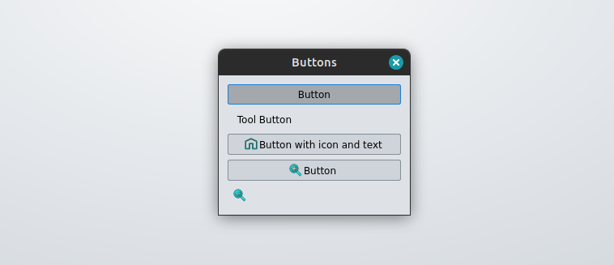</p>

#### Docs / button


| Return type    | Description                                       |
|----------------|---------------------------------------------------|
| QAbstractButton| The widget                                        |

| Argument       | Type           | Description                                |
|----------------|----------------|--------------------------------------------|
| label          | str            | text of the button, defaults to None       |
| tool           | bool           | use tool style button, defaults to False   |
| icon           | Union[QIcon, str]| icon, defaults to None                     |
| stretch        | int            | layout stretch, defaults to 0              |
| alignment      | Qt.Alignment   | layout alignment, defaults to Qt.Alignment()|
| add            | bool           | add to current context, defaults to True   |


Button Widget.

Example:
> *../examples/ui/widgets.py* (buttons)


```python
def demo_buttons():
    with ui.Dialog("Buttons", modal=False):

        @ui.button("Button")
        def btn1():
            ui.print_log("Hello btn1")

        @ui.button("Tool Button", tool=True)
        def btn2():
            ui.print_log("Hello btn2")

        @ui.button("Button with icon and text", icon=QIcon(":icons/Std_ViewHome.svg"))
        def btn3():
            ui.print_log("Hello btn3")

        @ui.button(icon=QIcon(":icons/zoom-in.svg"))
        def btn4():
            ui.print_log("Hello btn4")

        @ui.button(icon=QIcon(":icons/zoom-out.svg"), tool=True)
        def btn5():
            ui.print_log("Hello btn4")

```
    

## Layout tools

### Function: Stretch

#### Signature / Stretch

```python
def Stretch(stretch: int=0) -> None: ...
```


#### Docs / Stretch


| Argument       | Type           | Description                                |
|----------------|----------------|--------------------------------------------|
| stretch        | int            | 0-100 stretch factor, defaults to 0        |


Adds stretch factor to the current layout
### Function: Spacing

#### Signature / Spacing

```python
def Spacing(size: int) -> None: ...
```


#### Docs / Spacing


| Argument       | Type           | Description                                |
|----------------|----------------|--------------------------------------------|
| size           | int            | spacing                                    |


Adds spacing ro the current layout.